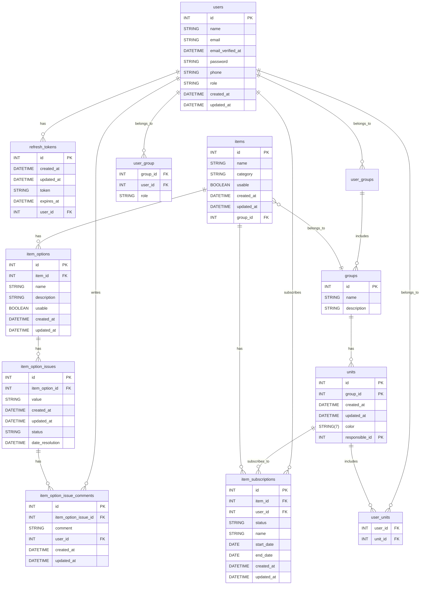

```mermaid
erDiagram

  users {
      INT id PK
      STRING name
      STRING email
      DATETIME email_verified_at
      STRING password
      STRING phone
      STRING role
      DATETIME created_at
      DATETIME updated_at
  }

  refresh_tokens {
      INT id PK
      DATETIME created_at
      DATETIME updated_at
      STRING token
      DATETIME expires_at
      INT user_id FK
  }

  items {
      INT id PK
      STRING name
      STRING category
      BOOLEAN usable
      DATETIME created_at
      DATETIME updated_at
      INT group_id FK
  }

  item_options {
      INT id PK
      INT item_id FK
      STRING name
      STRING description
      BOOLEAN usable
      DATETIME created_at
      DATETIME updated_at
  }

  item_option_issues {
      INT id PK
      INT item_option_id FK
      STRING value
      DATETIME created_at
      DATETIME updated_at
      STRING status
      DATETIME date_resolution
  }

  item_option_issue_comments {
      INT id PK
      INT item_option_issue_id FK
      STRING comment
      INT user_id FK
      DATETIME created_at
      DATETIME updated_at
  }

  item_subscriptions {
      INT id PK
      INT item_id FK
      INT user_id FK
      STRING status
      STRING name
      DATE start_date
      DATE end_date
      DATETIME created_at
      DATETIME updated_at
  }

  groups {
      INT id PK
      STRING name
      STRING description
  }

  user_group {
      INT group_id FK
      INT user_id FK
      STRING role
  }

  units {
    INT id PK
    INT group_id PK
    DATETIME created_at
        DATETIME updated_at
        STRING(7) color
        INT responsible_id PK
  }

  user_units {
      INT user_id FK
      INT unit_id FK
  }

  users ||--o{ refresh_tokens : has
  users ||--o{ item_option_issue_comments : writes
  users ||--o{ user_group : belongs_to

  %% un user appartient a un groupe
  users ||--o{ user_groups: belongs_to
  user_groups ||--o{ groups : includes

  groups ||--o{ units : has

  %% un user appartient a une unité
  users ||--o{ user_units : belongs_to
  units ||--o{ user_units : includes

  %% un user fait un emprunt pour une unité
  users ||--o{ item_subscriptions : subscribes
  units ||--o{ item_subscriptions : subscribes_to

  items ||--o{ item_options : has
  items ||--o{ item_subscriptions : has
  items }o--|| groups : belongs_to

  item_options ||--o{ item_option_issues : has
  item_option_issues ||--o{ item_option_issue_comments : has


```
